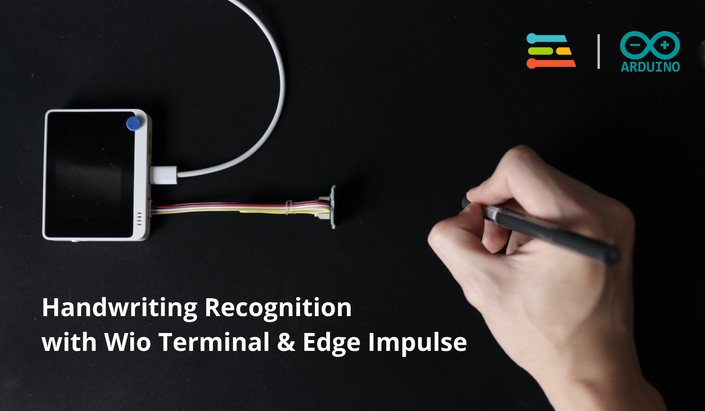

# WioTerminal_HandwritingRecogniser
Wio Terminal project for recognising handwriting gestures with a single ToF sensor. This project is powered by machine learning - more specifically a neural network created, trained and deployed with Edge Impulse.

